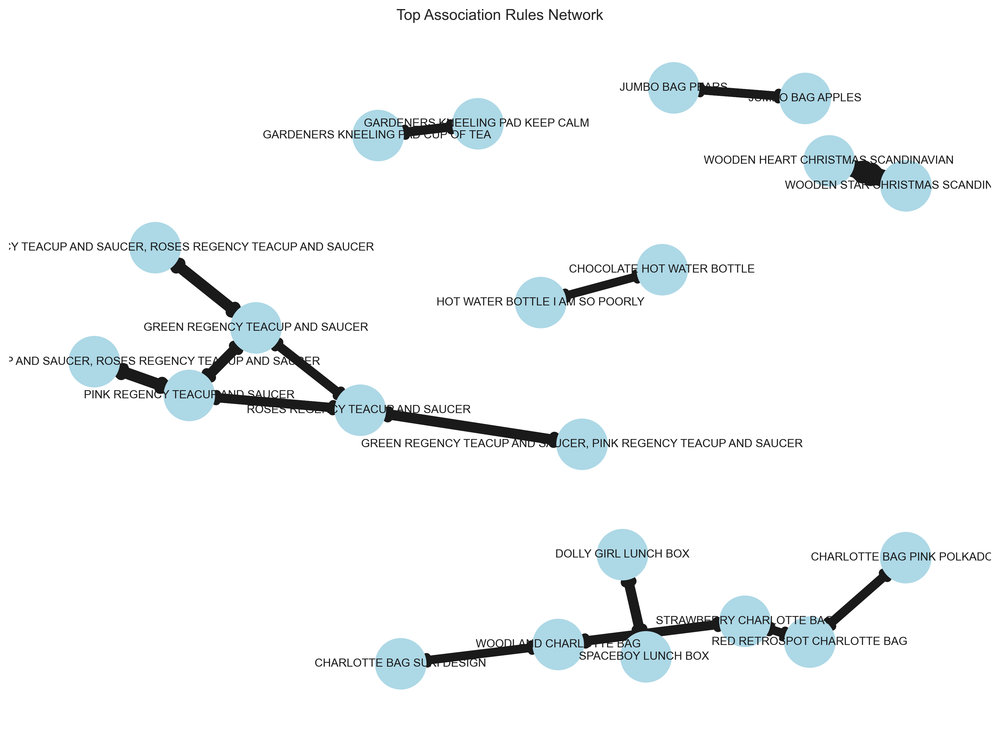

# 🛒 Market Basket Analysis — Online Retail Dataset

## 📌 Overview
This project applies **Market Basket Analysis** techniques on the [UCI Online Retail Dataset](https://archive.ics.uci.edu/ml/datasets/online+retail) to discover **association rules** between products.  
The goal is to simulate a real-world retail analytics workflow — something valuable in **marketing analytics** and **operations research**.

The analysis uses:
- **Apriori Algorithm** to find frequent itemsets  
- **Association Rules Mining** to uncover product relationships  
- **Visualization** of top product combinations

---
## 📂 Project Structure
market-basket-analysis
│
├── data/ 
│ ├── online_retail.csv # Raw transactional dataset
│ ├── frequent_itemsets.csv # Output: frequent itemsets
│ └── association_rules.csv # Output: generated rules
│
├── notebooks/
│ └── market_basket_analysis.ipynb # Main Jupyter Notebook 
│
├── images/ 
│ ├── top_items.png # Visualization of top products 
│ └── network_graph.png # Product association network 
│
├── requirements.txt # Dependencies 
└── README.md # Project documentation 

🛠️ Tech Stack
Python (pandas, mlxtend, matplotlib, seaborn)
Jupyter Notebook for analysis
Git & GitHub for version control

## Key Insights
Certain products frequently co-occur, suggesting cross-selling opportunities.
Confidence and lift metrics help prioritize which rules are most actionable.
The methodology can be applied to marketing campaign design, store layout optimization, and inventory planning.

## visualizations

### Lift Confidence Scatter

Scatter Plot — Support vs Confidence (color = lift)
X-axis (Support):
Support measures how frequently an itemset appears in all transactions. For example, a support value of 0.025 means that 2.5% of all baskets contain that itemset.
Y-axis (Confidence):
Confidence measures the likelihood that a customer who buys the antecedent will also buy the consequent.
Color (Lift):
Lift measures how much more likely the consequent is bought when the antecedent is bought, compared to random chance.
Bubble Size:
Larger bubbles indicate higher lift values (more interesting and stronger associations).
Interpretation:
Points clustered on the left (low support) are less common itemsets but may still have high confidence and lift.
Points higher on the y-axis have strong predictive relationships between items.
Bright yellow circles (high lift) indicate combinations of products that are bought together significantly more often than by chance—these are prime cross-selling opportunities.

### Association Rules Network

Nodes (circles):
Represent items or itemsets.
Edges (arrows):
Show the direction of association (from antecedent to consequent).
Edge Thickness:
Thicker arrows indicate stronger rules (higher lift or confidence).
Interpretation:
This graph visually reveals “clusters” of related products that tend to be bought together.
For example, items like "Green Regency Teacup and Saucer" and "Roses Regency Teacup and Saucer" are tightly connected, meaning customers frequently purchase them together.
Small, isolated clusters (like "Hot Water Bottle" items) might indicate niche product pairings.
Identifying these clusters can help in store layout, recommendation engines, and marketing campaigns.

Thank you everyone, if incase you want to improve the code please feel free to do #happycoding
